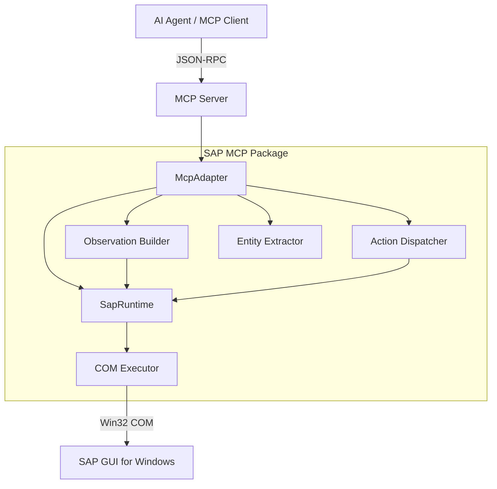

# Architecture Overview

The SAP MCP Adapter is designed to provide a stable, deterministic bridge between modern AI protocols and legacy SAP GUI automation.

## System Components

### 1. MCP Layer (`sap_mcp/mcp`)
This layer implements the Model Context Protocol. It handles the JSON-RPC communication, tool registration, and parameter validation. It translates incoming tool calls into internal service requests.

### 2. Runtime & Coordination (`sap_mcp/runtime`)
The `SapRuntime` is the heart of the adapter. It manages SAP sessions and ensures thread-safe execution of COM commands.
- **COM Executor**: Wraps all SAP GUI calls to ensure they run on the correct apartment thread (required by Windows COM).
- **BusyGuard**: Monitors the SAP status bar and "wait" states to prevent sending commands while SAP is processing.
- **ModalGuard**: Detects and handles unexpected modal dialogs or error popups.

### 3. Observation (`sap_mcp/observation`)
Converts the complex, nested SAP `GuiComponent` tree into a flat, serializable format.
- Extracts control types, IDs, labels, and values.
- Identifies "interactable" elements.
- Captures status bar messages.

### 4. Execution (`sap_mcp/execution`)
The `ActionDispatcher` translates abstract agent intents (e.g., "Click the Save button") into low-level SAP GUI scripting commands. It includes retry logic and "wait-for-idle" strategies.

### 5. Extraction (`sap_mcp/extraction`)
A domain-aware layer that understands specific SAP screen patterns. It can extract structured business objects (like a Sales Order header and its items) by traversing the control tree with known logic for specific transactions.

## Request/Response Flow

1. **Request**: The AI agent calls a tool (e.g., `sap_observe_screen`).
2. **Dispatch**: The `McpAdapter` receives the call and invokes the `ObservationBuilder`.
3. **Execution**: The `ObservationBuilder` requests the active session from `SapRuntime`.
4. **Safety Check**: `SapRuntime` checks if the session is "busy" or has a modal blocked.
5. **COM Call**: The `ComExecutor` performs the recursive tree traversal via `win32com`.
6. **Modeling**: The raw data is mapped to Pydantic models.
7. **Response**: The structured observation (including JSON controls and optional screenshot) is returned to the agent.
